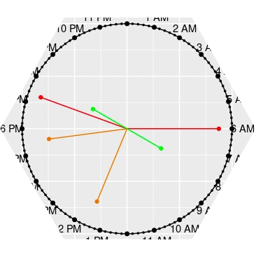
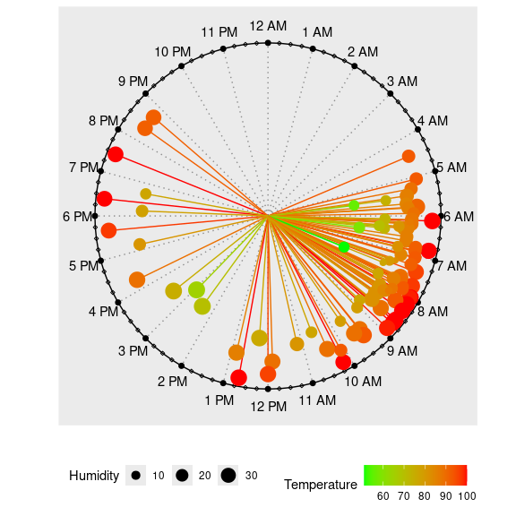
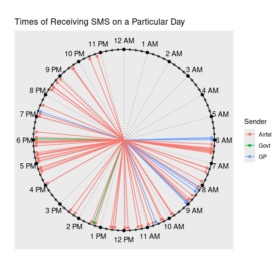
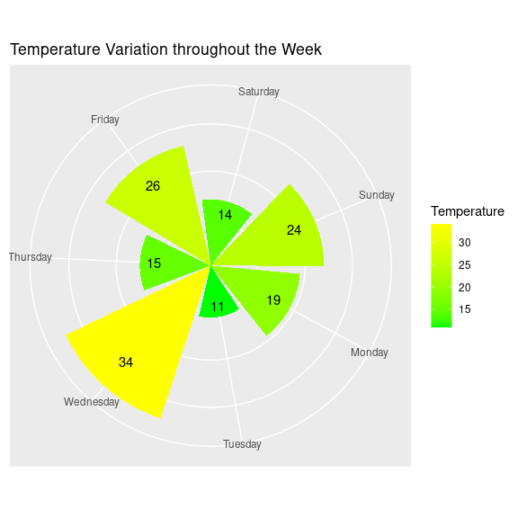

<!-- README.md is generated from README.Rmd. Please edit that file -->

# clockplot <a href="#"></a>

<!-- badges: start -->

[](https://github.com/mahmudstat/clockplot/actions/workflows/R-CMD-check.yaml)
[](https://doi.org/10.5281/zenodo.17087377)

<!-- badges: end -->

A novel visualization technique for plotting timestamped events on a
24-hour circular clock face. The *clockplot* package helps you uncover
daily patterns, event clusters, and gaps in your temporal data.

The approach generalizes to other cycles—like weeks and months—making it
an essential tool for visualizing rhythms and planning events across any
timeframe.

## Installation

You can install the latest version from CRAN with:

``` r
install.packages("clockplot")
```

You can install the development version of clockplot from
[GitHub](https://github.com/) with:

``` r
# install.packages("pak")
pak::pak("mahmudstat/clockplot")
```

## Usage

[Click here](https://github.com/mahmudstat/clockplot) to visit the
repository and follow the website (mentioned on the `About` section) to
see all the available functions.

## Applications

Below we mention some relevant applications.

#### US Accidents plot

The data is taken from
[Kaggle](https://www.kaggle.com/datasets/sobhanmoosavi/us-accidents) and
a small part (100 rows) extracted. To see the modified data, visit [this
link](https://raw.githubusercontent.com/mahmudstat/open-analysis/main/data/usacc.csv).

``` r
library(clockplot)
acdt <- read.csv("https://raw.githubusercontent.com/mahmudstat/open-analysis/main/data/usacc.csv")
clock_chart_qnt(acdt, time = Time, len = Humidity..., Col = Temperature.F.) +
  ggplot2::labs(size = "Humidity", color = "Temperature")
```



This allows us to observe when the accidents occurred and how
temperature and humidity may be associated with them.

#### A Simpler Chart

We have a small data of times of messages received throughout a
particular day, along with sender of the messages and their types. Let
us the pattern of messages by senders.



### Other Charts

Generally, there is `cyclic_chart()`, allowing to plot daily, weekly, or
monthly values or agenda on a circular plot. There are some specific
functions as well, relating to day, week etc.

### Week Chart



## Additional Components

The charts produce `ggplot` objects, so you can make use of many of the
functions of the `ggplot2` package. You can use the `labs` function, for
example, to add `title`, `subtitle`, `caption` etc. Some examples are
shown in the next segment.

You can also add legend or change its position by using the code
`theme(legend.position = "right")`; the accepted positions are `top`,
`bottom`, `left`, and `right`.
